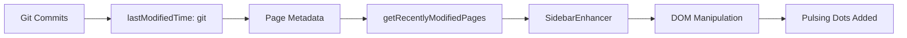

# Recent Modification Indicators - Implementation Guide

## Overview

A minimalist pulsing dot indicator system that shows recently modified components and blocks in the sidebar. The system uses Git commit history to automatically detect modifications within the last 7 days.

## Features

✅ **Automatic Detection**: Uses Git timestamps from `lastModifiedTime: "git"` config
✅ **Minimalist Design**: Small pulsing blue dot at the right of sidebar items
✅ **Configurable Threshold**: Easily adjust the "recent" timeframe
✅ **Tooltips**: Hover to see when the component was last updated
✅ **Performance**: Efficient lookup using Set data structure
✅ **Non-Intrusive**: Enhances existing Fumadocs sidebar without replacing it

## Files Created

### Core Components

1. **`lib/recent-modified.ts`**
   - Utility functions to check if a page is recently modified
   - Calculates human-readable modification labels
   - Configurable day thresholds

2. **`components/recent-indicator.tsx`**
   - Minimalist pulsing dot component
   - Blue color with subtle animation
   - Includes accessibility tooltips

3. **`components/sidebar-enhancer.tsx`**
   - Client-side component that enhances the Fumadocs sidebar
   - Uses DOM manipulation to add indicators without breaking Fumadocs
   - Includes MutationObserver for client-side navigation

4. **`lib/config.ts`**
   - Centralized configuration
   - Easy threshold adjustment
   - Feature toggle

### Modified Files

1. **`lib/source.ts`**
   - Added `isPageRecentlyModified()` function
   - Added `getRecentlyModifiedPages()` for efficient lookup
   - Integrated with config for threshold

2. **`app/docs/layout.tsx`**
   - Integrated `SidebarEnhancer` component
   - Passes recently modified URLs to enhancer

## How It Works



1. **Build Time**: Fumadocs reads Git history and adds `lastModified` timestamps to page metadata
2. **Page Load**: `getRecentlyModifiedPages()` checks all pages against the threshold (7 days)
3. **Client Render**: `SidebarEnhancer` finds sidebar links and adds indicators to recently modified items
4. **Navigation**: MutationObserver re-applies indicators after client-side navigation

## Configuration

### Adjust Time Threshold

Edit `apps/docs/lib/config.ts`:

```typescript
export const siteConfig = {
  // Change from 7 to any number of days
  recentModifiedThreshold: 14, // Show items modified in last 2 weeks

  // Disable the feature entirely
  showRecentModifications: false,
} as const;
```

### Customize Indicator Appearance

Edit `apps/docs/components/recent-indicator.tsx`:

**Change Color:**
```tsx
{/* Change bg-blue-400/bg-blue-500 to other colors */}
<span className="... bg-green-400 ..." /> {/* Outer ring */}
<span className="... bg-green-500 ..." /> {/* Dot */}
```

**Change Size:**
```tsx
{/* Change h-2 w-2 to h-3 w-3 for larger dot */}
<span className="relative ml-auto flex h-3 w-3">
  <span className="... h-full w-full ..." />
  <span className="... h-3 w-3 ..." />
</span>
```

**Change Animation Speed:**
```tsx
{/* Change duration-1000 to duration-500 for faster pulse */}
<span className="... animate-ping ... duration-500" />
```

**Remove Animation:**
```tsx
{/* Remove animate-ping class */}
<span className="absolute inline-flex h-full w-full rounded-full bg-blue-400 opacity-75" />
```

## Visual Design Options

### Current Design (Implemented)
```
Component Name        •
```
- Minimalist pulsing dot
- Blue color (#3B82F6)
- Subtle animation
- Right-aligned

### Alternative Designs

**Option 1: Badge with Text**
```tsx
<span className="ml-auto rounded-full bg-blue-500/10 px-2 py-0.5 text-xs font-medium text-blue-600">
  New
</span>
```

**Option 2: Icon**
```tsx
import { Sparkles } from "lucide-react";
<Sparkles className="ml-auto h-3 w-3 text-blue-500" />
```

**Option 3: Different Colors by Age**
```tsx
// Green for today, blue for this week
const color = diffInHours < 24 ? "green" : "blue";
<span className={`... bg-${color}-500`} />
```

## Testing

### Manually Test a Component

1. **Modify a component file**:
   ```bash
   # Edit any component
   echo "// test comment" >> packages/smoothui/components/siri-orb/index.tsx

   # Commit the change
   git add .
   git commit -m "test: trigger recent indicator"
   ```

2. **Rebuild the docs** to update Git timestamps:
   ```bash
   pnpm build
   ```

3. **Start dev server and check sidebar**:
   ```bash
   pnpm dev
   ```

   The modified component should now show a pulsing blue dot.

### Check Which Pages Are Detected

Add this to `app/docs/layout.tsx` temporarily:

```tsx
export default function Layout({ children }: LayoutProps<"/docs">) {
  const recentlyModifiedUrls = getRecentlyModifiedPages();

  // Debug: Log to console
  console.log('Recently modified pages:', Array.from(recentlyModifiedUrls));

  return (
    <DocsLayout ...>
      ...
    </DocsLayout>
  );
}
```

## Troubleshooting

### Indicators Not Showing

1. **Check if Git timestamps are enabled**:
   - Verify `apps/docs/.source/source.config.mjs` has `lastModifiedTime: "git"`

2. **Check if any pages are recent**:
   - Add console.log in layout.tsx to see `recentlyModifiedUrls.size`
   - If 0, no pages were modified in the last 7 days

3. **Check browser console**:
   - Look for any JavaScript errors from sidebar-enhancer.tsx

4. **Verify sidebar data attribute**:
   - Inspect sidebar element - should have `[data-sidebar]` attribute
   - If not, Fumadocs might have changed their markup

### Indicators Disappear on Navigation

The `SidebarEnhancer` uses a MutationObserver to re-add indicators after client-side navigation. If they disappear:

1. Check browser console for errors
2. Verify the observer is working by adding debug logs
3. The sidebar might be re-rendered in a way that breaks the observer

### Performance Issues

If the page feels slow:

1. **Reduce threshold**: Lower `recentModifiedThreshold` to scan fewer pages
2. **Optimize lookup**: The current implementation uses `Set` which is O(1) lookup
3. **Disable feature**: Set `showRecentModifications: false` in config

## Future Enhancements

Possible improvements:

1. **Multiple Thresholds**: Show different colors for "today", "this week", "this month"
2. **Badge Count**: Show number of recently modified items in sidebar header
3. **Filter Toggle**: Button to show only recently modified components
4. **RSS Feed**: Generate RSS feed of recently modified components
5. **GitHub API**: Fetch real-time modification data instead of build-time Git data
6. **Animation Variants**: Different animations based on modification recency

## Dependencies

- `fumadocs-ui`: Sidebar component framework
- `fumadocs-core`: Source and page tree management
- Git: For automatic timestamp detection

## Browser Support

✅ Modern browsers (Chrome, Firefox, Safari, Edge)
✅ MutationObserver API (IE 11+)
✅ CSS animations
✅ Tailwind CSS classes

## Performance

- **Build Time**: Negligible (Git timestamps already collected)
- **Runtime**: O(n) scan of all pages once, then O(1) lookups
- **DOM Operations**: Minimal - only adds one `<span>` per recent item
- **Memory**: Small `Set` of URLs (typically < 50 items)

## Accessibility

✅ **Tooltips**: `title` attribute for screen readers
✅ **ARIA Labels**: `aria-label` on indicator
✅ **Color Contrast**: Blue meets WCAG AA standards
✅ **Motion**: Respects `prefers-reduced-motion` (via Tailwind's `animate-ping`)
